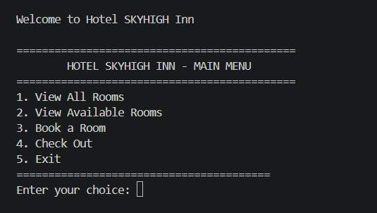
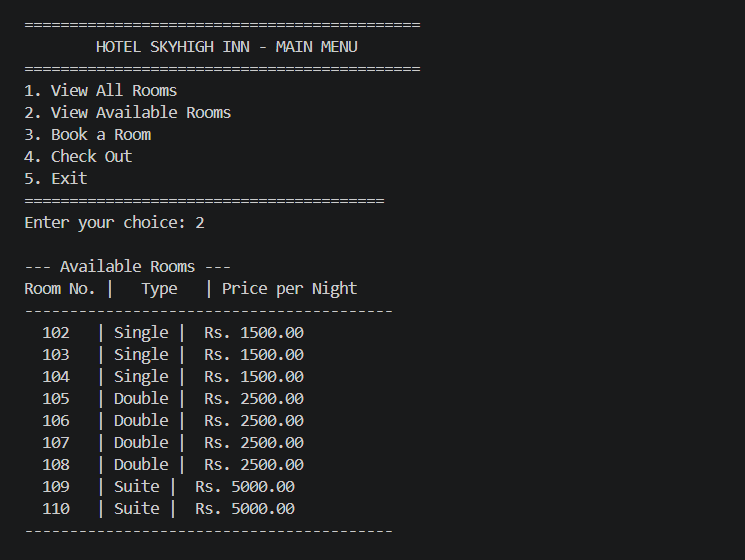
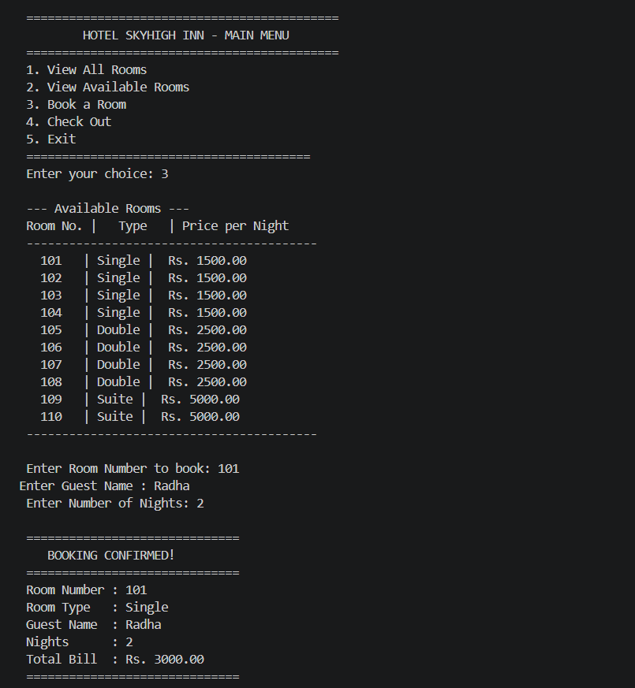

# Hotel Booking System

A command-line hotel booking system developed in C that allows users to manage room bookings, check room availability, and generate billing information.

## Project Overview

This project was built to apply core C programming concepts to a real-world problem. The system simulates basic hotel management operations such as booking rooms, viewing available rooms, managing guest information, and calculating bills.

The project follows a menu-driven approach and demonstrates how data can be organized and managed using structures and functions in C.

## Features

* View all rooms and their booking status
* View available rooms
* Book a room
* Store guest details
* Generate billing information
* Check out guests
* Update room availability automatically

## Technologies Used

* C Programming
* Structures
* Arrays
* Functions
* String Handling
* Conditional Statements
* Loops

## Concepts Implemented

### Structures

Used structures to store room and guest information efficiently.

### Functions

The project is divided into multiple functions to improve readability and maintainability.

### Arrays

Arrays of structures were used to manage multiple room records.

### User Input Handling

Implemented menu-driven interaction and validation of user inputs.

### Billing Logic

Calculated room charges based on room type and duration of stay.

## What I Learned

Through this project, I learned:

* How to design a menu-driven application in C
* Practical use of structures for managing real-world data
* Working with arrays of structures
* Breaking large problems into smaller functions
* Managing user input and program flow
* Implementing basic business logic such as booking and billing systems
* Improving debugging and problem-solving skills

## Sample Workflow

1. View available rooms
2. Select a room for booking
3. Enter guest details
4. Confirm booking
5. Generate bill during checkout
6. Update room status after checkout

## Screenshots

### Main Menu

### Available Rooms

### Room Booking

## Future Improvements

* File handling for permanent data storage
* Admin login system
* Room categories and pricing management
* Customer booking history
* Improved user interface

## Acknowledgements

This project was developed as part of my coursework to strengthen my understanding of C programming and problem-solving using real-world applications.
